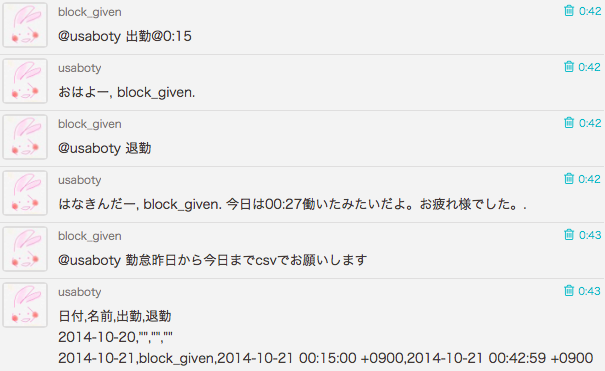

# Ruboty::Kintai

ruboty plugin for 勤怠管理.



## Installation

Add this line to your application's Gemfile:

```ruby
gem 'ruboty-kintai'
```

If you want to use `勤怠3週間前から1週間前までcsvで`

```ruby
gem 'tokiyomi', github: 'moro/tokiyomi'
```

And then execute:

    $ bundle

Or install it yourself as:

    $ gem install ruboty-kintai

## Usage

    @ruboty 出勤
    @ruboty 退勤
    @ruboty 勤怠１ヶ月前から今日までcsvで

## Contributing

1. Fork it ( https://github.com/blockgiven/ruboty-kintai/fork )
2. Create your feature branch (`git checkout -b my-new-feature`)
3. Commit your changes (`git commit -am 'Add some feature'`)
4. Push to the branch (`git push origin my-new-feature`)
5. Create a new Pull Request
